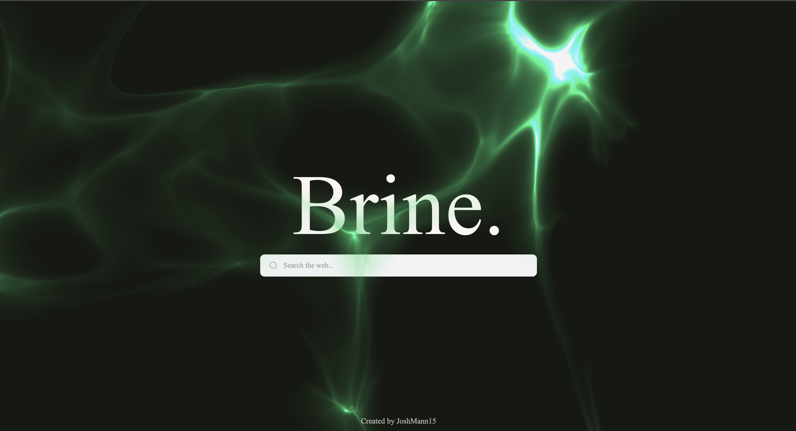

<div align=center>
   
   <h3>🚀 Lightweight, Anonymous Web Proxy 🚀</h3>
   <p>Brine is a high-performance web proxy designed for bypassing internet censorship with ease. Built on the powerful <a href="https://github.com/titaniumnetwork-dev/Ultraviolet">Ultraviolet</a> backend, Brine provides a seamless and secure browsing experience with a focus on speed and anonymity.</p>
</div>



## Features ✨

- **Lightweight**: Minimal resource usage for maximum efficiency.
- **Fast**: Optimized for low latency and high-speed browsing.
- **Anonymous**: Protects user privacy by masking online activity.
- **Custom UI**: A clean, minimalist frontend for easy navigation.
- **Seamless Integration**: Runs effortlessly on modern web hosting services.
- **Open Source**: Fully customizable for personal or organizational use.

## Installation 📥

### Local Deployment 🏠
1. Clone the repository:
   ```sh
   git clone https://github.com/JoshMann15/Brine.git
   cd Brine
   ```
2. Install dependencies:
   ```sh
   npm install
   ```
3. Start the server:
   ```sh
   node index.js
   ```
4. Open your browser and go to `http://localhost:3000`

### Deploy on Vercel ☁️🚀
Brine includes a `vercel.json` configuration for easy deployment on [Vercel](https://vercel.com/):  
[](https://vercel.com/new/clone?https://github.com/JoshMann15/Brine)

## Usage 👀

- Navigate to the main page (`index.html`).
- Enter a URL or search query to browse anonymously.
- The proxy will encode and serve the requested content through Ultraviolet.

## License ⚖️

Brine is open-source software released under the MIT License. See the [LICENSE](LICENSE) file for details.

## Contributing 🤝

Contributions are welcome! Feel free to open issues or submit pull requests.

## Credits 🎖🛠️

- By JoshMann15
- Built with [Ultraviolet](https://github.com/titaniumnetwork-dev/Ultraviolet)
- Inspired by open-source proxy networks.

---
<p align=center><b><i>✨ Brine: Surf the web without limits. ✨</i></b></p>

